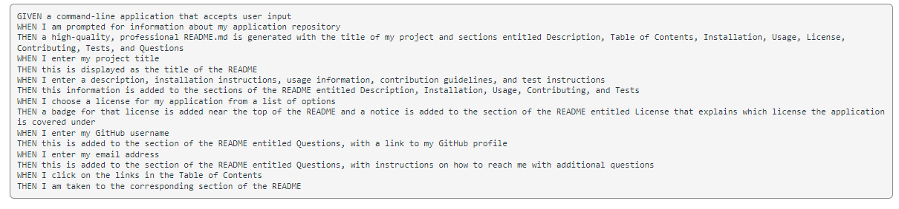
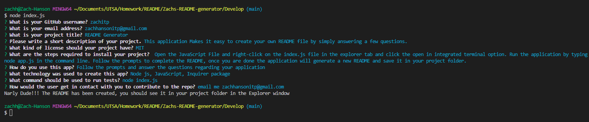
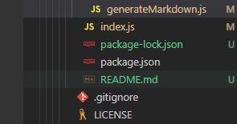

# Zach's README Generator

#### By Zach Hanson 
in collaboration with UTSA

## Purpose
This application Makes it easy to Create your own README file by simply answering a few questions.

## Usage

1. Open the Javascript File
2. Right click on the index.js file in the explorer tab and click the open in integrated terminal option.
3. Run the application by typing node app.js in the command line.
4. Follow the prompts to complete the README.
5. Once you are done the application will generate a new README and save it in this folder, you can find it in the explorer tab.

## Technologies Used

Node js, 
JavaScript,
Inquirer package

## Credits
Thank you UTSA tutor Alistair Rowden for answering some questions regarding this project.

## Video Walkthrough 
Checkout a walkthrough of the project here

## License
MIT Copyright (c) Zach Hanson

Permission is hereby granted, free of charge, to any person obtaining a copy of this software and associated documentation files (the "Software"), to deal in the Software without restriction, including without limitation the rights to use, copy, modify, merge, publish, distribute, sublicense, and/or sell copies of the Software, and to permit persons to whom the Software is furnished to do so, subject to the following conditions:

The above copyright notice and this permission notice shall be included in all copies or substantial portions of the Software.

THE SOFTWARE IS PROVIDED "AS IS", WITHOUT WARRANTY OF ANY KIND, EXPRESS OR IMPLIED, INCLUDING BUT NOT LIMITED TO THE WARRANTIES OF MERCHANTABILITY, FITNESS FOR A PARTICULAR PURPOSE AND NONINFRINGEMENT. IN NO EVENT SHALL THE AUTHORS OR COPYRIGHT HOLDERS BE LIABLE FOR ANY CLAIM, DAMAGES OR OTHER LIABILITY, WHETHER IN AN ACTION OF CONTRACT, TORT OR OTHERWISE, ARISING FROM, OUT OF OR IN CONNECTION WITH THE SOFTWARE OR THE USE OR OTHER DEALINGS IN THE SOFTWARE.
